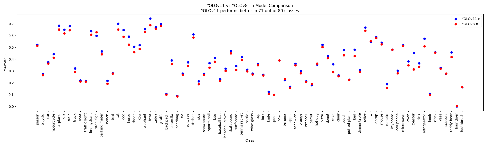
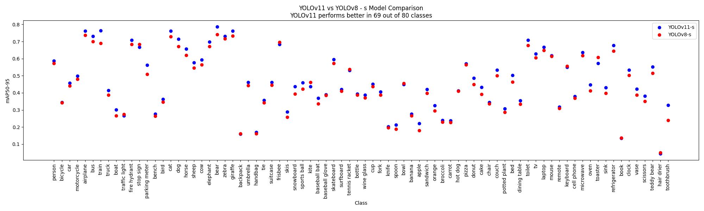
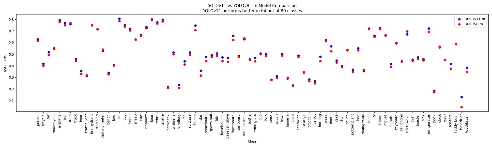
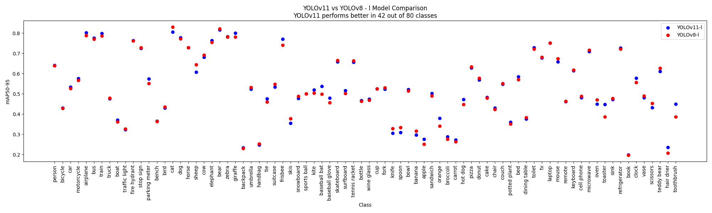
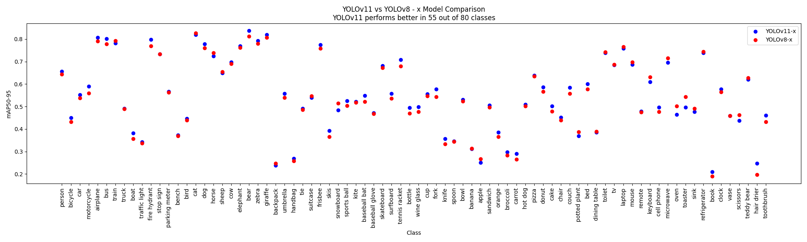

# yolov8-vs-yolo11

## Evaluation Results

I didn't measure inference time of models because I was too lazy, and Ultralytics had already done it.

| Model Config | YOLOv8 (mAP50-95) | YOLO11 (mAP50-95) | mAP50-95 Improvement (YOLO11 - YOLOv8) |
|--------------|-------------------|-------------------|----------------------------------------|
| N            | 0.371             | 0.392             | 0.021                                  |
| S            | 0.447             | 0.467             | 0.020                                  |
| M            | 0.501             | 0.514             | 0.013                                  |
| L            | 0.529             | 0.532             | 0.003                                  |
| X            | 0.540             | 0.547             | 0.007                                  |

---
- [YOLOv8n.csv](yolov8n-coco-results.csv)
- [YOLOv8s.csv](yolov8s-coco-results.csv)
- [YOLOv8m.csv](yolov8m-coco-results.csv)
- [YOLOv8l.csv](yolov8l-coco-results.csv)
- [YOLOv8x.csv](yolov8x-coco-results.csv)
---
- [YOLO11n.csv](yolo11n-coco-results.csv)
- [YOLO11s.csv](yolo11s-coco-results.csv)
- [YOLO11m.csv](yolo11m-coco-results.csv)
- [YOLO11l.csv](yolo11l-coco-results.csv)
- [YOLO11x.csv](yolo11x-coco-results.csv)

## [YOLOv8n](yolov8n-coco-results.csv) vs [YOLO11n](yolo11n-coco-results.csv)

## [YOLOv8s](yolov8s-scoco-results.csv) vs [YOLO11s](yolo11s-coco-results.csv)

## [YOLOv8m](yolov8m-scoco-results.csv) vs [YOLO11m](yolo11m-coco-results.csv)

## [YOLOv8l](yolov8l-scoco-results.csv) vs [YOLO11l](yolo11l-coco-results.csv)

## [YOLOv8x](yolov8x-scoco-results.csv) vs [YOLO11x](yolo11x-coco-results.csv)

